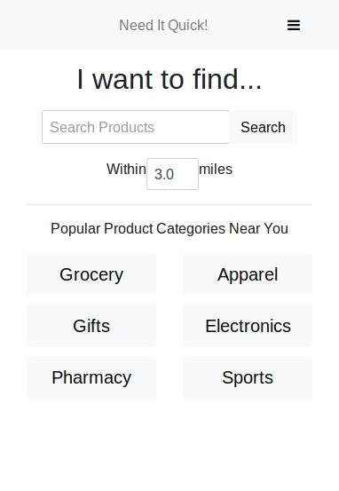
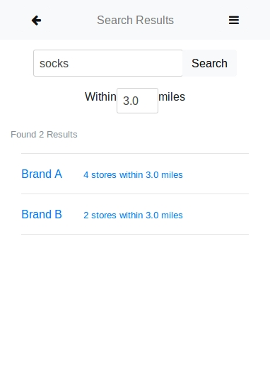
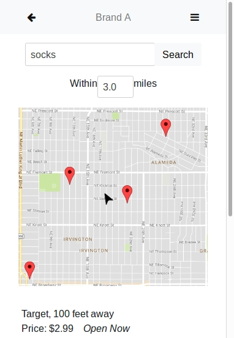
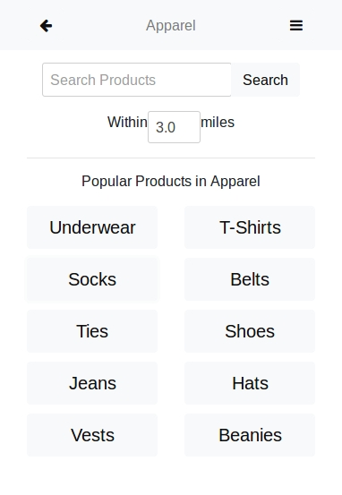

# Need It Quick! Mockup

For my Human-Computer Interactions course, a couple of the assingments had me work with another student on their app concept, which was known as "*Need It Quick!*". Essentially, the concept was a phone app where you could search for products and be given locations on where said products were sold near you. My part in this was creating a series of mockups testing the user interface for this theoretical app.

Here is a medium-to-high fidelity mockup built on a basic Flask webapp, using Bootstrap styling to emulate the look and feel of a smartphone application. 

## Run locally
Requires [Python 3.x](https://www.python.org/)

```bash
# Install Requirements
$ pip install -r requirements.txt

# Run the app (access on localhost:5000 in your browser)
$ python run.py
```

## Run using Docker
Requires [Docker](https://www.docker.com/)

```bash
# Build the container
$ docker build -t needit:latest .

# Run the container (access on localhost:5000 in your browser)
$ docker run -it -p 5000:5000 needit:latest
```

## Screenshots







